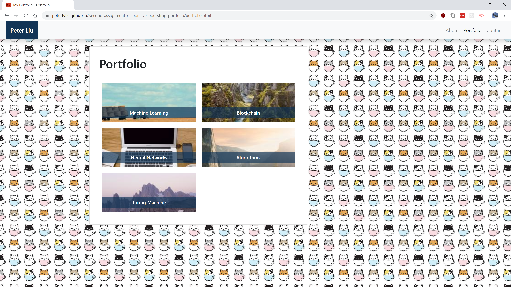
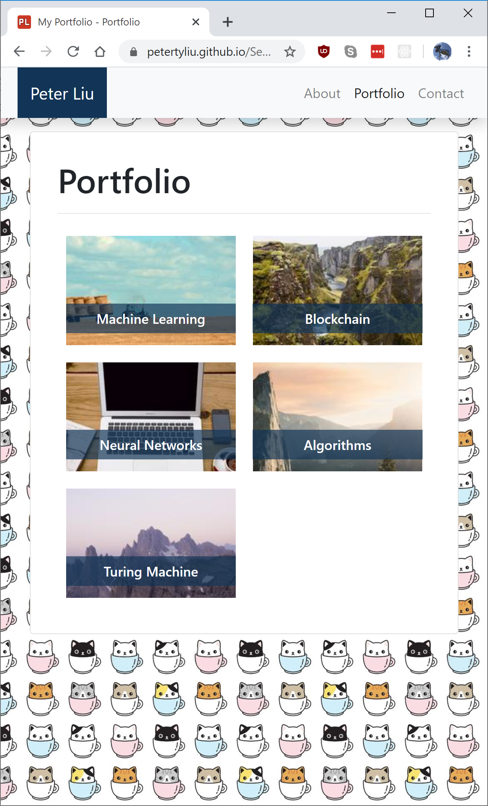
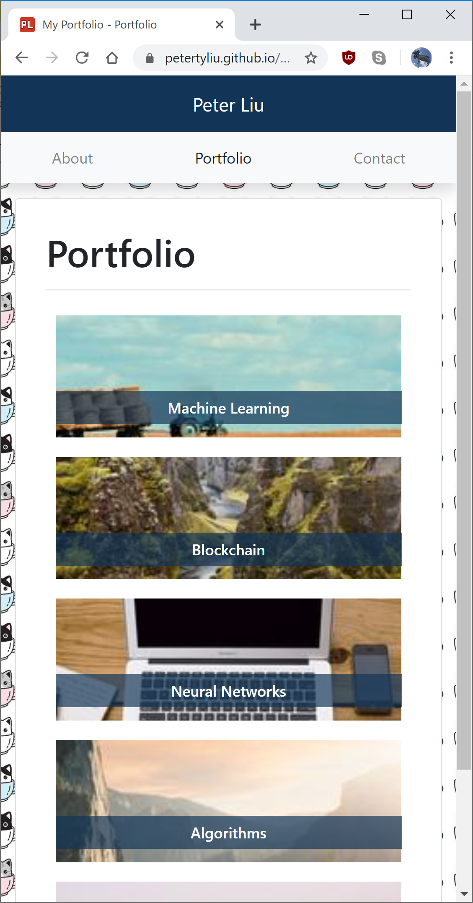

# Assignment 2: Responsive Bootstrap Portfolio

**The Assignment:** Create a 3-page portfolio website, using Bootstrap to create a grid-based responsive layout. Minimize media queries and follow the visual prompts given.

**Deployed site:** https://petertyliu.github.io/Second-assignment-responsive-bootstrap-portfolio/index.html

## Screenshots

